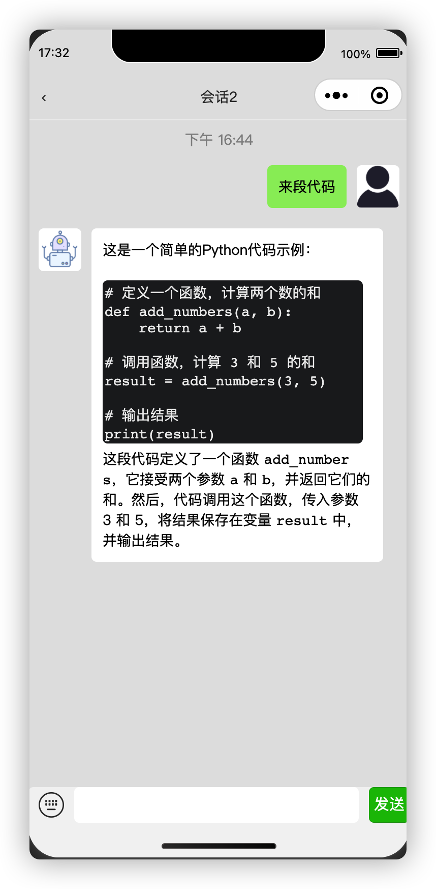
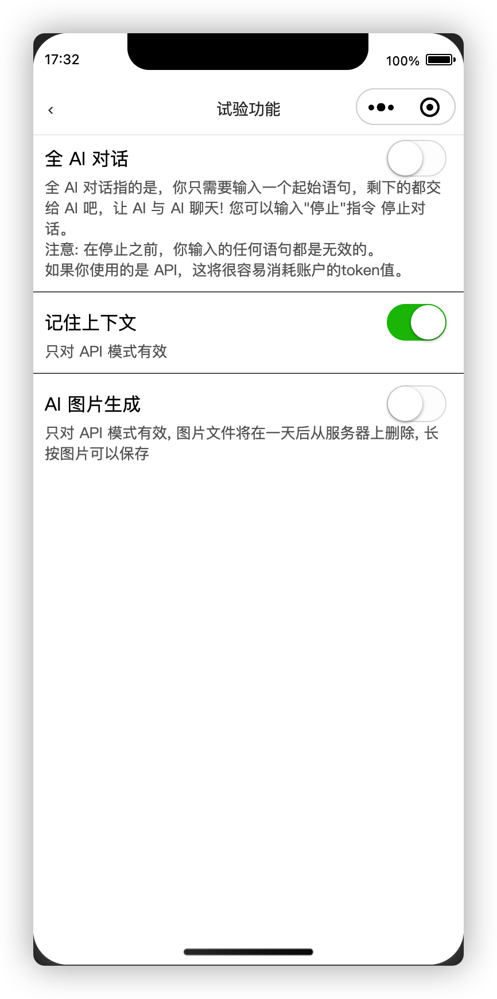
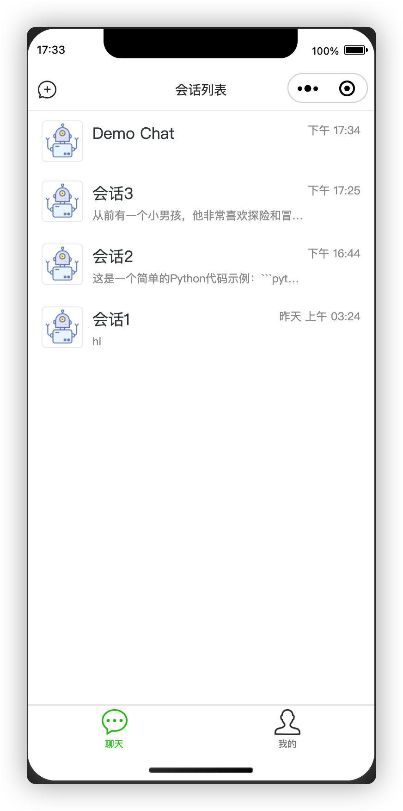
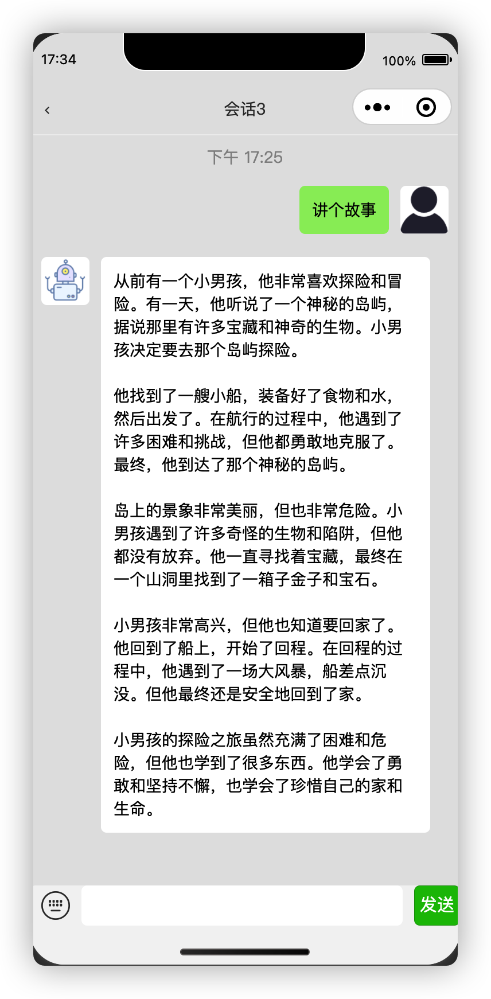
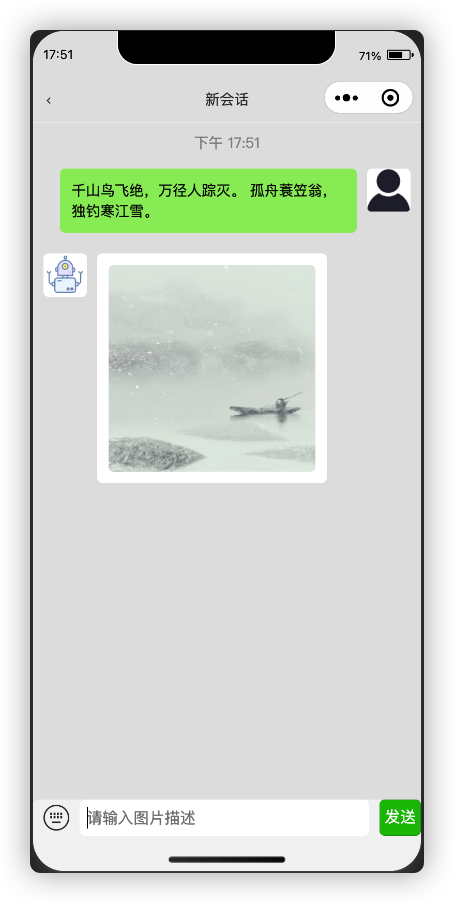

# 基于 uni-app的ChatGPT微信小程序版

  

   基于uni-app 的前端程序，扩展用于AI 聊天等。
与服务端通过websocket通信。可打包成小程序/网页H5 app/客户端(没试过)。觉得不错请右上角Star。

    	</img>
		</img>
        </img>
        </img>
        </img>
        </img>

## 项目介绍

1. 本项目是基于uni-app开发，使用websocket方式 与服务端进行通信，异步响应无需等待! 支持记住上下文的连续对话，全AI对话和AI生成图片。
   可以通过账号密码、token(感谢[acheong08](https://github.com/acheong08/ChatGPT)提供的代理) 方式，以及 API-Key 方式登录，其中**账号密码、token方式**有被**永久封禁账号**的风险，不建议使用!!!
2. 支持生成的文本复制，图片保存至相册
3. 仿微信聊天 UI
4. 界面干净整洁无广告
5. 可打包成小程序/网页H5 app等

## 小程序截图

## 项目地址

目前项目托管在 **Gitee** 和 **Github** 平台上中，欢迎大家 **Star** 和 **Fork** 支持~

- Gitee地址：https://gitee.com/gulihua/wxmini-chatgpt
- Github地址：https://github.com/gulihua10010/wxmini-chatgpt

## 其他ChatGpt相关项目
- 微信小程序服务端API程序:https://github.com/gulihua10010/chatGptApi
- openAi授权SDK:https://github.com/gulihua10010/openAiAuth
- chatGpt API SDK:https://github.com/gulihua10010/chatGptApiSdk
- chatGpt命令行客户端:https://github.com/gulihua10010/ChatGpt

### 前端技术

|   说明    |              官网               |
|:-------:|:-----------------------------:|
| uni-app | https://uniapp.dcloud.net.cn/ |
|   VUE   |      https://vuejs.org/       |
|  uView  |   https://www.uviewui.com/    |
|          
## 项目打包/部署
1. 把项目导入到 HBuilderX 里
2. 修改[App.vue](App.vue)里的globalData，把 server 和 websocket 改成后端服务的真实地址
3. 点击运行或发行

## 介绍
ChatGPT 是由 OpenAI 开发的世界知名的对话式 AI 模型，以对各种提示和查询生成类似人类的响应而闻名。凭借其尖端功能，ChatGPT 是聊天机器人、虚拟助手和其他自然语言处理应用程序的宝贵资产。
ChatGPT API 是一个强大的工具，允许开发人员将 ChatGPT 模型集成到他们自己的应用程序中。但是，要使用此 API，用户需要拥有 OpenAI API 密钥并支付使用费。

## Open ChatGPT 倡议
ChatGPT代表了人工智能和人类科技发展的新高度。它彻底改变了我们获取知识的方式，提升了许多人的写作和表达能力。凭借其强大的语言理解和文本生成能力，ChatGPT 已成为人类生产力和创造力的工具。

然而，当我与普通大众分享 ChatGPT 时，那些没有 AI 背景的人，我收到的回应不仅仅是赞美和惊奇，还有怀疑和怀疑。

一些人声称之前见过很多聊天机器人，而 ChatGPT 只是众多聊天机器人中的一个。过去的聊天机器人无法理解人类表达背后的意图。但是 ChatGPT 不像他们。其强大的语言理解和生成能力使其成为未来不可或缺的工具。

其他人则认为人工智能无法超越人类智慧，它只是从人类创造的数据中学习。不管真相如何，人工智能并不需要超越全人类的创造力来影响我们的日常生活。事实上，只要人工智能超越了每个个体的能力，它就能更好地协助人们，为我们的工作和生活方式带来变革性的影响。

还有一些人声称 ChatGPT 会产生错误的内容，捏造虚假信息，或者进行看似合乎逻辑但错误的推理，我们需要停止使用它。但这样做就像把婴儿连同洗澡水一起倒掉。ChatGPT 确实很有用，因为它简化了查找信息的过程，因为事实核查总是比从头开始搜索信息更容易。而且，随着人工智能技术的应用越来越广泛，我们应该熟悉ChatGPT等人工智能工具，了解它们在哪些方面容易出错，而不是简单地回避，更好地避免它们。

还有一些人认为，使用 ChatGPT 自动获取答案会阻碍批判性思维和解决问题能力的发展。然而，使用 ChatGPT 并不意味着将人类的思想委托给机器或停止人类的思考。ChatGPT 无法自动提供深刻的见解或敏锐的想法。事实上，对于不常见的问题，ChatGPT 只能提供笼统而陈腐的意见。关键是用户提供意见，ChatGPT 创建连贯的文章。

另一种说法认为，ChatGPT 创建的内容是没有灵魂的，因为它在创建时缺乏意识。然而，这个论点的正确性并不重要。最重要的一点是，未来人工智能技术无疑会越来越先进。想象一下二十年后的世界，人工智能将成为日常生活中无处不在的一部分。回顾 ChatGPT，人们可能会有不同的感受。我们现在必须熟悉人工智能技术，因为它越来越深入地融入我们的日常生活。

现在，让我们仔细看看 ChatGPT 背后的技术：自然语言处理。即使在 NLP 领域本身，许多人还没有意识到 ChatGPT 的颠覆性影响。

自然语言处理研究方法论的演变，从基于规则的方法到机器学习再到深度学习，证明了人类语言的复杂性。复杂性决定了自然语言处理不是写几条规则那么简单。它需要不断的改进和探索。现在，共指消解、依存分析和词性标注都被自然语言处理抛弃了。以后连命名实体识别、语法纠错都会显得滑稽可笑。随着 ChatGPT 彻底改变了 NLP 领域，NLP 研究人员必须积极熟悉这项尖端技术以迎接这个新时代。

## 环境搭建

### 开发工具

|    工具     |   说明    |                             官网                             |
|:---------:|:-------:| :----------------------------------------------------------: |
| HbuilderX | 前端开发工具  |           https://www.dcloud.io/|
|  Postman  | 前端开发IDE |           https://www.postman.com/             |

### 开发环境

|   工具    | 版本号 |                             下载                             |
|:-------:| :----: | :----------------------------------------------------------: |
| Node.js |  1.8   | https://nodejs.org/en |

### 部署平台

|   平台   |           说明           |               官网               |
| :------: | :----------------------: | :------------------------------: |
| 宝塔面板 | 安全高效的服务器运维面板 | https://www.bt.cn/new/index.html |

## 贡献代码

开源项目离不开大家的支持，如果您有好的想法，遇到一些 **BUG** 并修复了，欢迎小伙伴们提交 **Pull Request** 参与开源贡献

1. **fork** 本项目到自己的 **repo**
2. 把 **fork** 过去的项目也就是你仓库中的项目 **clone** 到你的本地
3. 修改代码
4. **commit** 后 **push** 到自己的库
5. 发起**PR**（ **pull request**） 请求，提交到  **Nacos** 分支
6. 等待作者合并

## 隐私声明
1. 本项目高度重视隐私，致力于保护用户的隐私。服务器端的程序不会对账号密码、accessToken、 API-Key、用户信息等做任何存储和日志记录，这点可以放心使用。
   开发者高度优先考虑您的API密钥/Access Token/账号信息的安全，并非常小心地处理它。您的密钥将专门存储在您的小程序/浏览器中，并且永远不会与任何第三方实体共享。它仅用于授权的预期用途，而不是用于任何其他未经授权的用途。 该项目的源代码可供检查以验证此声明。如何您不信任本项目,可以使用API-Key的方式，用完可以随时在官网删除相关API-Key。
2. 但是，OpenAI API 会根据其[数据使用政策](https://openai.com/policies/privacy-policy)将数据保留 30 天。

## 免责声明
1. 本程序仅供娱乐, 且仅用于测试和学习研究！禁止将源码用于商业用途，不能保证其合法性，准确性，完整性和有效性，请根据情况自行判断。
2. 开发者对任何用户操作所导致的问题概不负责，包括但不限于由任何脚本错误导致的任何损失或损害。
3. 请勿将本项目的任何内容用于商业或非法目的，否则后果自负。
4. 以任何方式查看此网站的使用者都应仔细阅读此声明。作者保留随时更改或补充此免责声明的权利。
   一旦使用并操作(包括但不限于测试，部署，运行于本地或服务器)了本程序，则视为您已接受此免责声明。

## 开源协议

[Apache License 2.0](https://www.apache.org/licenses/LICENSE-2.0.html)

## 赞赏

**服务器**和**域名**等服务的购买和续费都会**产生一定的费用**，为了**维持项目的正常运作**，如果觉得本项目**对您有帮助**的话，欢迎朋友能够给予一些支持

